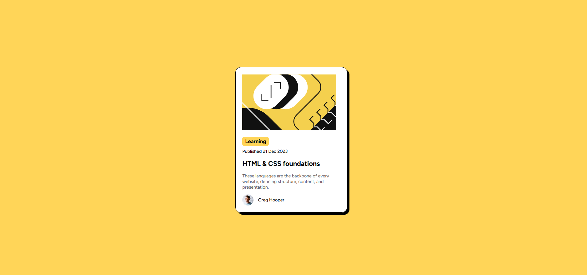

# Frontend Mentor - Blog preview card solution

This is a solution to the [Blog preview card challenge on Frontend Mentor](https://www.frontendmentor.io/challenges/blog-preview-card-ckPaj01IcS). Frontend Mentor challenges help you improve your coding skills by building realistic projects. 

## Table of contents

- [Overview](#overview)
  - [The challenge](#the-challenge)
  - [Screenshot](#screenshot)
  - [Links](#links)
- [My process](#my-process)
  - [Built with](#built-with)
  - [What I learned](#what-i-learned)
  - [Continued development](#continued-development)
  - [Useful resources](#useful-resources)
- [Author](#author)
- [Acknowledgments](#acknowledgments)

**Note: Delete this note and update the table of contents based on what sections you keep.**

## Overview

### Screenshot

### Links
- Live Site URL: [Add live site URL here](https://your-live-site-url.com) (TBD)

## My process

### Built with

- HTML5
- CSS (Flexbox)

### What I learned
This project gives some useful tips:
- To center a box in the middle of the page, use flexbox, then choose 'center' for both align-items and justify-content
- Use \<h> whenever possible instead of \
 (for example see element contain the word 'Learning')
- For the author section, it can be a separate \
, then apply Flexbox to justify the avatar and author's name on one line
- box-shadow: \<offset x axis>, \<offset y axis>, ... to create a shadow for the container

### Continued development
I am trying to find more Flexbox applications to practice.

## Author
- Frontend Mentor - [@tdnguyen04](https://www.frontendmentor.io/profile/tdnguyen04)
